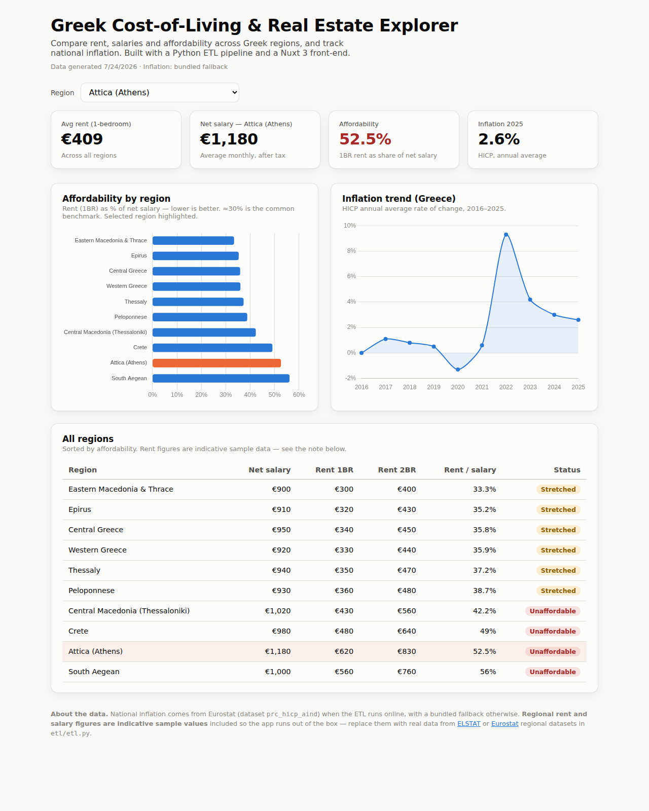

# 🇬🇷 Greek Cost-of-Living & Real Estate Explorer

An interactive dashboard that compares **rent, salaries, affordability and
inflation** across Greek regions. Built as a full **data-to-dashboard** project:
a Python ETL pipeline cleans the data, and a Nuxt 3 / Vue 3 front-end visualises it.

> **Why this project exists (my portfolio story):** with a background in Economics
> and front-end development, I wanted to answer a real question — *where in Greece
> is it actually affordable to rent?* — by building the whole stack myself, from
> data pipeline to interactive UI.



---

## ✨ What it shows

- **KPI cards** — average rent, disposable income per capita and affordability for the selected region, plus latest inflation.
- **Affordability by region** — a horizontal bar chart ranking regions by rent as a % of monthly disposable income (≈30% is the common benchmark). The selected region is highlighted.
- **Inflation trend** — Greek HICP annual inflation over the last decade (the 2022 energy-crisis spike is clearly visible).
- **Regions table** — full breakdown with an affordability status pill (Affordable / Stretched / Unaffordable).

## 🧱 Tech stack

| Layer | Tech |
|---|---|
| Data pipeline | **Python** (`requests`) → Eurostat REST API |
| Front-end | **Nuxt 3 + Vue 3** (SSR), TypeScript composables |
| Charts | **Chart.js** via `vue-chartjs` |
| Styling | Plain CSS with a validated, colour-blind-safe palette |
| Deploy | **Vercel** (zero-config) |

## 📊 About the data

- **Inflation** is **real data** from Eurostat (dataset `prc_hicp_aind`, indicator
  `RCH_A_AVG`, geo `EL`), fetched live when the ETL runs online.
- **Regional income** is **real data** from Eurostat (dataset `nama_10r_2hhinc`,
  net disposable income per inhabitant `EUR_HAB`), produced by
  [ELSTAT](https://www.statistics.gr/) and published via Eurostat.
- **Rent figures are indicative market data** — rent by region is *not* an official
  statistic, so replace them with a source you trust (e.g. Spitogatos / XE market
  reports) in `etl/etl.py` (`REGIONS`). 👈 a great first improvement to make it yours.
- Every network call **falls back to bundled values when offline**, so the app
  always builds.

---

## 🚀 Getting started

### 1. Generate the dataset (Python)

```bash
cd etl
pip install -r requirements.txt      # only needs `requests`
python etl.py                        # writes ../public/data/economy.json
```

### 2. Run the front-end (Node 18+)

```bash
npm install --legacy-peer-deps       # see note below
npm run dev                          # http://localhost:3000
```

> **Note on `--legacy-peer-deps`:** some npm versions hit a peer-dependency
> resolution bug with the Nuxt toolchain. If a plain `npm install` errors, this
> flag is the standard workaround.

### 3. Build for production

```bash
npm run build        # server build  → node .output/server/index.mjs
npm run generate     # static build  → deploy the .output/public folder anywhere
```

## ☁️ Deploy to Vercel (free)

1. Push this repo to GitHub.
2. On [vercel.com](https://vercel.com), "Add New Project" → import the repo.
3. Vercel auto-detects Nuxt. Set install command to `npm install --legacy-peer-deps` if needed.
4. Deploy → you get a public URL to put on your CV. 🎉

---

## 🗺️ Project structure

```
greek-cost-of-living-explorer/
├── etl/
│   ├── etl.py              # Python ETL: Eurostat fetch + affordability calc
│   └── requirements.txt
├── public/data/
│   └── economy.json        # generated dataset the app reads
├── composables/
│   └── useEconomy.ts       # data loading + helpers (typed)
├── components/
│   ├── KpiCard.vue
│   ├── AffordabilityChart.vue
│   ├── InflationChart.vue
│   └── RegionsTable.vue
├── pages/
│   └── index.vue           # the dashboard
├── assets/css/main.css     # design tokens + layout
└── nuxt.config.ts
```

---

## 🎯 Ideas to extend it (make it yours)

These are deliberately left for you — each one is a talking point in an interview:

1. **Real regional data.** Wire `etl/etl.py` to ELSTAT / Eurostat regional
   datasets instead of the sample figures.
2. **Interactive map.** Add a choropleth of Greece (D3.js + a GeoJSON of NUTS-2
   regions) coloured by affordability — big visual "wow".
3. **Dark mode.** The palette already has dark values defined; add a theme toggle.
4. **Filters & time range.** Filter the inflation chart by year range; add a
   category breakdown (housing, food, energy) from Eurostat COICOP data.
5. **A prediction.** Use the AI/ML skills from your diploma — a simple regression
   (scikit-learn) forecasting next year's rent or inflation, surfaced in the UI.
6. **Tests.** Add a couple of Vitest unit tests for the affordability helpers.

---

## 📄 License

MIT — do whatever you like with it.
